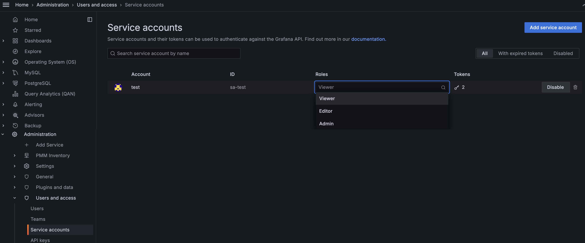
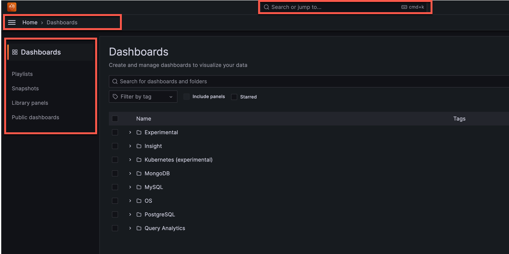

# Percona Monitoring and Management 3.0.0 Alpha

| **Release date** | April 30th, 2024                                                                                   |
| ----------------- | ----------------------------------------------------------------------------------------------- |
| **Installation** | [Installing Percona Monitoring and Management](https://www.percona.com/software/pmm/quickstart) |

Percona Monitoring and Management (PMM) is an open source database monitoring, management, and observability solution for MySQL, PostgreSQL, and MongoDB.

It enables you to observe the health of your database systems, explore new patterns in their behavior, troubleshoot them and execute database management operations—regardless of whether your databases are located on-premises or in the cloud.

## Release highlights

PMM version 3.x marks a new milestone for PMM, now built on a more secure foundation, with an enhanced user experience and easier deployment across a broader range of environments.

## Improved security

### Enhanced API authentication with Grafana service accounts

With the release of PMM 3.x, we've made a significant enhancement to the way API authentication is handled. PMM no longer relies on API keys as the primary method for controlling access to the PMM Server components and resources. Instead, PMM now leverages Grafana service accounts, which provide a more secure and manageable authentication mechanism compared to API keys.

The transition to service accounts brings several advantages:

- Fine-grained access control, ensuring that each account gets access only to the necessary resources.
- Logging of all actions performed, providing better visibility and auditing.
- Easy rotation of credentials that doesn't impact associated applications.

When you install PMM 3.x, any existing API keys will be seamlessly converted to service accounts with corresponding service tokens. For more information about using service accounts in PMM, see [Service accounts authentication](../api/authentication.md).

### More options for deploying PMM rootless

In addition to Podman, PMM Server can also now be deployed rootless with Helm, Docker, Virtual Appliance, or Amazon AWS.

This setup prioritizes security by eliminating the need for root privileges to create, run, and manage containers. Running PMM Server as a non-root user means that you never have to give a user root permission on the host. This adds an extra layer of security, essential for protecting against potential security breaches.

For detailed instructions on deploying rootless PMM, check the [Setting up PMM Server](https://docs.percona.com/percona-monitoring-and-management/setting-up/index.html#set-up-pmm-server) topic.

### Transition to Oracle Linux 9 completed

With the release of PMM 3, we are completing the transition away from CentOS/RHEL 7-based builds and fully embracing Oracle Linux 9 as the default operating system for PMM-base images. This transition began with PMM 2.38 and is now being finalized for all users, including those who had upgraded from 2.37 and earlier versions using the **PMM Upgrade** option on the Home Dashboard.

By leveraging Oracle Linux 9 as the default operating system, we are ensuring a more stable, updatable and well-maintained operating system for PMM's base images.

## Improved UX

### Grafana upgraded to latest version

PMM now integrates Grafana 10.4, which delivers the following important enhancements alongside all the advancements introduced since the previous Grafana 9.2.20 integration. For the full list of changes included in this update, see [Grafana's 10.4 release blog](https://grafana.com/blog/2024/03/06/grafana-10.4-release-all-the-latest-features/).

#### Improved navigation
With the 10.4 update, PMM now includes a revamped header with search, breadcrumbs, and a reorganized menu that groups related tools together, making it easier to navigate PMM's features and find what you need:

#### Improved Alerting workflow
Leveraging the new Grafana user interface updates, we've taken the opportunity to refine the workflow for creating alerts from the **Alert Rules** and **Alert Rule Templates** pages.

You'll notice separate, more visible options for creating different types of alert rules, cutting down on unnecessary steps and making it easier to manage various alert rules, templates, and configurations:

#### One central location for all Administration settings

All PMM-related configuration and inventory options have been relocated from the **Configuration** section to a unified **Administration** menu.
Grouping all administration-related tools means that you get easier, centralized access to all PMM configuration settings, making it easier to find what you need.

For more details about all the changes coming Grafana v10.4, see [Grafana's release blog](https://grafana.com/blog/2024/03/06/grafana-10.4-release-all-the-latest-features/).

## Enhanced PMM deployment on AMI and OVF environments

PMM is now deployed inside containers within AMI and OVF instances. These containers are managed via Podman and operate in rootless mode, which means they do not require root privileges to run. This approach significantly increases security and ensures a consistent and unified experience across different deployment types.

## Finalized DBaaS migration to Percona Everest

In previous PMM releases, the Database as a Service (DBaaS) functionality has been gradually transferred to Percona Everest, a standalone product, dedicated to streamlined database deployment and management.
While PMM 2.x versions continue to support existing DBaaS functionality, PMM 3 marks the complete migration, removing all references to DBaaS. 

If you are an existing PMM user who relies on DBaaS functionality, we encourage you to explore [Percona Everest](https://www.percona.com/resources/percona-everest) and leverage its advanced features for your database deployment needs.

## Improvements

[PMM-10974](https://perconadev.atlassian.net/browse/PMM-10974) - 

## Fixed issues

[PMM-12806](https://perconadev.atlassian.net/browse/PMM-12806) - 

